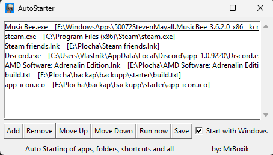

# 🚀 auto starter

This is a small utility I coded that can launch any file, folder, or application automatically when Windows starts.
I made it to simplify managing my own startup items, but it can help anyone streamline their workflow.

## ➡️ [Download](https://github.com/MrBoxik/auto-starter/releases/tag/1.0)

---

## 🧩 Features

- ⚡ Launch anything like file, folder, .lnk or application ... at Windows start-up
- 🔁 Multiple items supported, with ordering (Move Up / Move Down)
- ▶️ “Run now” to test launching immediately
- 💾 Config is saved atomically to items.json in app data directory
- 🧲 Drag & drop support
- 🔒 Safety: app will not allow adding itself to the list (avoids loops)

---

## 📸 Application Preview

---

## 🛡️ Important

Windows Defender or other antivirus software may flag this program as malicious because it automatically runs what you want on your computer.
- You can whitelist it if you trust it.
- Or simply delete it if you prefer.

It’s fully open source, so you can go through the code and verify for yourself that it only does what you want.

---

## 💬 Feedback or Questions?

You can leave feedback [here on GitHub](https://github.com/MrBoxik/auto-starter/issues) — but I’m not going to be super active here.  

You’ll have better chances of getting a reply if you message me on [Discord](https://discord.com/users/638802769393745950).

---

## ☕ Support

If this helped you and you want to say thanks, you can [buy me a coffee](https://buymeacoffee.com/mrboxik).  
Totally optional, just appreciated. ❤️

---

## 📜 License

This project is licensed under a **Custom Non-Commercial License**.  

You are free to use, modify, and share the code for personal and non-commercial purposes, with attribution.  
**Commercial use is not allowed** without prior written permission from the author.  

See the [LICENSE](LICENSE) file for full details.  
